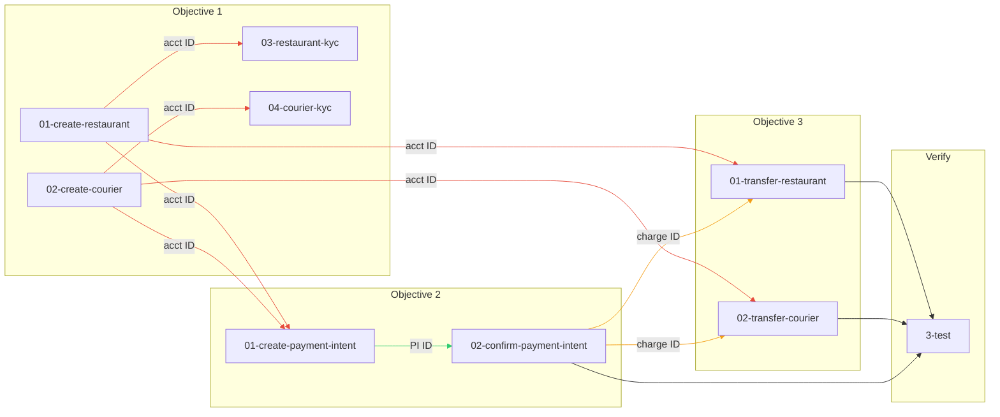

# Stripe Connect Demo -- On-Demand Delivery Service

## How scripts chain together

Each script calls the Stripe API and saves the full JSON response to a file in its own folder. The next script in the sequence reads that file to extract the IDs it needs. This is how data flows between steps without hardcoding any Stripe object IDs.

For example, `01-create-restaurant.sh` creates a connected account and saves the response to `01-create-restaurant-response.json`. That response contains the account ID (`acct_xxx`). When `03-restaurant-fulfill-kyc.sh` runs, it opens that JSON file, extracts the `id` field, and uses it to call `POST /v1/accounts/acct_xxx` with the KYC data.

The same pattern continues across objectives. The payment scripts in `1-Collect-Payment/` need to know the restaurant and courier account IDs (for metadata), so they read from the onboarding response files in `0-Onboarding/`. The transfer scripts in `2-Route-Funds/` need the charge ID from the confirmed payment, so they read `latest_charge` from `02-confirm-payment-intent-response.json`. The verify scripts in `3-test/` read from all of the above.

This means:

1. Scripts must run in order. A transfer script will fail if the payment script hasn't run yet, because the response file it depends on doesn't exist.
2. Response files are the single source of truth for object IDs. No IDs are hardcoded in any script.
3. Response files are gitignored because they contain IDs specific to your Stripe test account. A fresh clone requires running the scripts from the beginning to generate them.

### Dependency chain

**Objective 1 (Onboarding)** has no dependencies -- it creates the first resources.

- `01-create-restaurant.sh` and `02-create-courier.sh` create accounts and write response files.
- `03-restaurant-fulfill-kyc.sh` reads the restaurant account ID from `01-create-restaurant-response.json`.
- `04-courier-fulfill-kyc.sh` reads the courier account ID from `02-create-courier-response.json`.

**Objective 2 (Payment)** depends on Objective 1.

- `01-create-payment-intent.sh` reads both account IDs from the onboarding response files (for metadata) and writes `01-create-payment-intent-response.json`.
- `02-confirm-payment-intent.sh` reads the PaymentIntent ID from that file and writes `02-confirm-payment-intent-response.json`, which contains `latest_charge` -- the charge ID needed by Objective 3.

**Objective 3 (Transfers)** depends on both Objectives 1 and 2.

- `01-transfer-restaurant.sh` reads the restaurant account ID from `0-Onboarding/01-create-restaurant-response.json` and the charge ID from `1-Collect-Payment/02-confirm-payment-intent-response.json`.
- `02-transfer-courier.sh` does the same for the courier.

**Verification (3-test/)** depends on all three objectives. Each verify script reads from the response files generated above and queries the Stripe API to assert the current state of each object.

### Dependency graph



Arrow colors: red = account ID, green = PaymentIntent ID, orange = charge ID. Grey arrows to Verify are unlabeled (all response files).

## Execution order

```bash
# Objective 1: Onboard
bash 0-Onboarding/01-create-restaurant.sh
bash 0-Onboarding/02-create-courier.sh
bash 0-Onboarding/03-restaurant-fulfill-kyc.sh
bash 0-Onboarding/04-courier-fulfill-kyc.sh

# Objective 2: Collect Payment
bash 1-Collect-Payment/01-create-payment-intent.sh
bash 1-Collect-Payment/02-confirm-payment-intent.sh

# Objective 3: Route Funds
bash 2-Route-Funds/01-transfer-restaurant.sh
bash 2-Route-Funds/02-transfer-courier.sh

# Verify
bash 3-test/01-verify-accounts/01-verify-accounts.sh
bash 3-test/02-verify-payment/02-verify-payment.sh
bash 3-test/03-verify-transfers/03-verify-transfers.sh
bash 3-test/04-verify-sct-pattern/04-verify-sct-pattern.sh
bash 3-test/05-verify-events/05-verify-events.sh
```

## Prerequisites

- `STRIPE_DEMO_KEY` environment variable set to your `sk_test_...` key
- `python3` and `curl` available
- Run from the `demo/` directory

## Response files

Response JSON files (`*-response.json`) are gitignored. They are generated locally by running the scripts and contain live Stripe object IDs specific to your test account.
