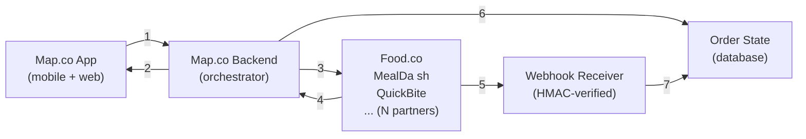
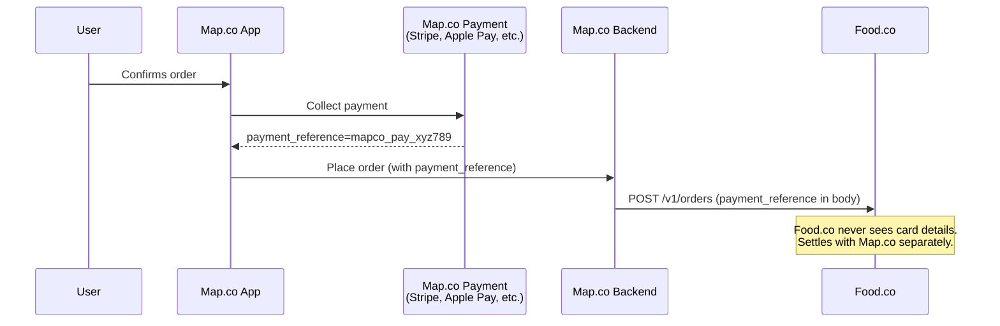
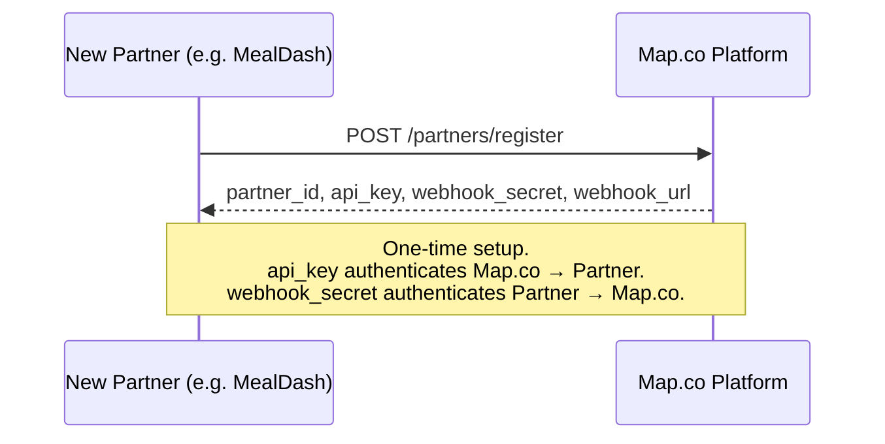
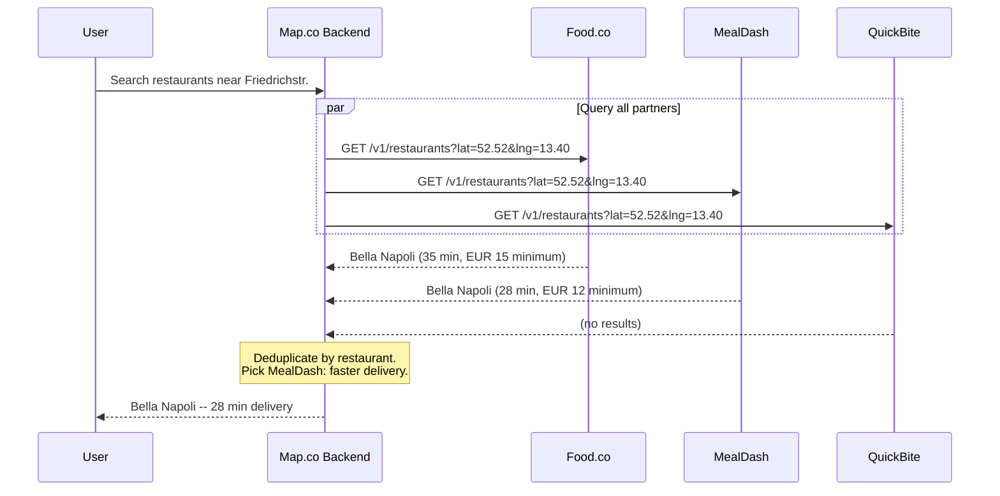
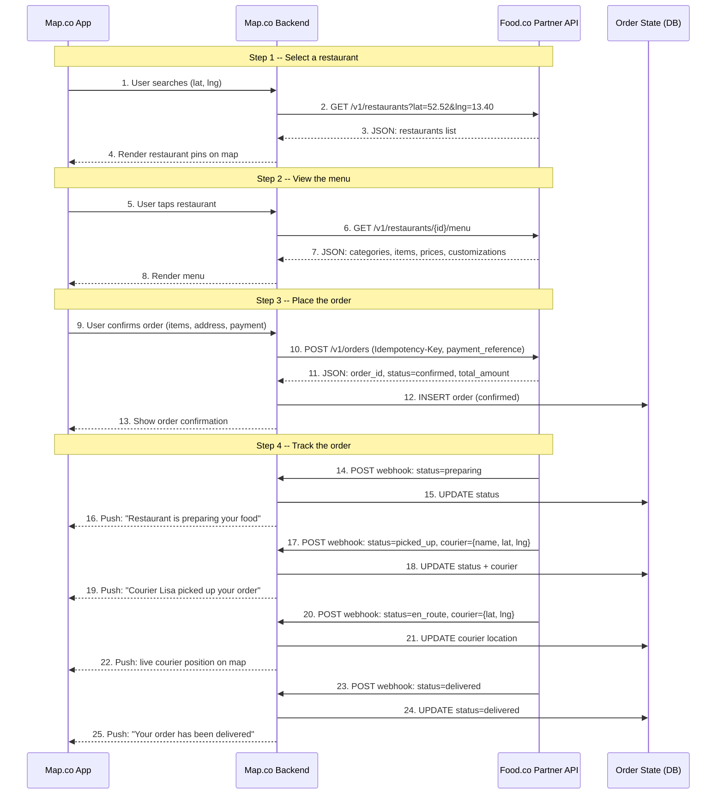

# Map.co Food Ordering -- Reverse API Design

## The Brief

You're a product manager at Map.co (think Google Maps). Your company has signed partnerships with the largest on-demand food delivery companies worldwide -- the most prominent being Food.co (think Uber Eats, DoorDash). The goal: let Map.co users order food from nearby restaurants directly inside the Maps app, without switching to another app.

Your frontend team has built a working UX. The delivery partners are impressed. As a next step, they've agreed to integrate against your "reverse API" -- an interface of your design where you make the requests and they handle them.

The reverse API doesn't exist yet. You need to design it.

**User flow:**
1. Select a restaurant
2. View the menu and select/customize items
3. Make the order
4. Track the order

**Objectives:**
1. High-level design between Map.co and Food.co partners
2. API endpoints each Food.co partner must implement, with key request/response fields
3. Any additional functionality Map.co needs to expose to partners

---

## What is an API?

An API (Application Programming Interface) is a contract between two software systems that defines how they communicate. One system sends a structured request, the other returns a structured response. The contract specifies: what you can ask for, how to ask for it, and what you'll get back.

Think of it as a function signature in a typed language. `getRestaurants(lat: float, lng: float) -> List[Restaurant]` is an API in the abstract sense. An HTTP API makes this concrete: you send `GET /v1/restaurants?lat=52.52&lng=13.40` over the network, and you receive a JSON list of restaurant objects. The caller doesn't need to know how the server finds those restaurants -- it only needs to know the interface.

In this design, we're defining an API that Map.co will call and Food.co will implement. The contract is the set of endpoints, their input parameters, and their response shapes. Multiple partners (Food.co, MealDash, QuickBite) all implement the same contract, so Map.co can talk to any of them identically -- the same way a function interface in code lets you swap implementations without changing the caller.

**"Reverse API"** means Map.co designs the spec and Food.co conforms to it. The typical pattern is the opposite: Food.co would publish their own API and Map.co would integrate against it. Here, Map.co has the leverage (user base, distribution), so they dictate the contract. The partners adapt.

## The Problem

Map.co has hundreds of millions of users searching for places on a map. Food.co and other delivery companies have restaurants, couriers, and logistics. The business opportunity is obvious: let Map.co users order food without leaving the app.

The naive approach is to build a custom integration for each delivery partner. Map.co engineers study Food.co's API, write a connector, then do the same for MealDash, QuickBite, and every other partner. Each partner has different endpoints, different data formats, different authentication, different error codes. This creates N separate integrations that must be maintained independently. It doesn't scale.

The reverse API solves this by inverting the relationship. Instead of Map.co adapting to N different partner APIs, Map.co publishes one spec and all partners adapt to it. Adding a new partner means they implement the same contract -- Map.co's code doesn't change. This is the same principle behind USB: one standard plug, every device manufacturer conforms to it.

The API must support four operations that map to the user journey: find nearby restaurants, browse a menu, place an order, and track it until delivery. Everything else -- payment, user accounts, the map UI -- stays on Map.co's side.

---

## Architecture Overview

Three systems, two communication patterns. This is a RESTful API with webhook callbacks -- REST for the synchronous request-response flow, webhooks for the asynchronous event-driven flow.

### System Diagram



**Map.co App** -- the user interface. Shows restaurants, menus, order form, live tracking.

**Map.co Backend** -- the orchestrator. Receives user actions, calls the partner API, stores order state, receives webhooks. Never exposes partner APIs directly to the app. This gives Map.co control over caching, error handling, and partner failover.

**Food.co Partner API** -- each delivery partner implements the same API contract. Food.co, MealDash, QuickBite all expose identical endpoints. Map.co talks to all of them the same way.

**Why a reverse API?** Map.co defines the contract. Partners implement it. This is the same model as Stripe: Stripe defines the webhook format, and platforms implement the handler. The alternative -- Map.co integrating against each partner's proprietary API -- doesn't scale. One spec, many implementors.

### Edge Descriptions

Edges 1-4 are synchronous: the user does something, and the systems exchange requests and responses in real time. Edges 5 and 7 are asynchronous: the partner pushes updates to Map.co when something changes on their side, without the user asking.

**1. User action → Backend.** The user interacts with the Map.co app -- opens the map, taps a restaurant, confirms an order, checks delivery status. The app sends the action to the Map.co backend.

```
POST /internal/search-restaurants
{ "lat": 52.52, "lng": 13.40, "radius_km": 5 }
```

**2. Backend → App (response).** The backend returns data to the app for rendering: a list of nearby restaurants, a restaurant's menu, an order confirmation, or the current delivery status.

```json
{
  "restaurants": [
    { "id": "rest_abc123", "name": "Bella Napoli", "cuisine": "italian",
      "estimated_delivery_min": 35, "is_open": true }
  ]
}
```

**3. Backend → Partner API (request).** The backend calls the Food.co partner API over HTTP. This is the core of the entire design -- the boundary between Map.co's system and Food.co's system. The reverse API contract governs what crosses this boundary. HTTP is the transport because it's the lowest common denominator: every partner already has HTTP infrastructure, it works across firewalls, and it's what the industry standardizes on for public APIs.

```
GET https://api.foodco.example/v1/restaurants?lat=52.52&lng=13.40&radius_km=5
Authorization: Bearer mk_live_...
```

Order placement example:

```
POST https://api.foodco.example/v1/orders
Authorization: Bearer mk_live_...
Idempotency-Key: mapco_order_12345

{
  "restaurant_id": "rest_abc123",
  "items": [{ "item_id": "item_001", "quantity": 2 }],
  "delivery_address": { "street": "Unter den Linden 1", "city": "Berlin", "postal_code": "10117", "country": "DE" },
  "payment_reference": "mapco_pay_xyz789"
}
```

**4. Partner API → Backend (response).** The partner returns a JSON response.

Restaurant listing example:

```json
{
  "restaurants": [
    { "id": "rest_abc123", "name": "Bella Napoli", "lat": 52.5200, "lng": 13.4050,
      "cuisine": "italian", "rating": 4.6, "estimated_delivery_min": 35,
      "is_open": true, "min_order_amount": 1500 }
  ],
  "total": 87, "limit": 20, "offset": 0
}
```

Order confirmation example:

```json
{
  "order_id": "ord_food_456",
  "status": "confirmed",
  "estimated_delivery_min": 40,
  "total_amount": 3200,
  "currency": "eur"
}
```

**5. Partner → Webhook Receiver (async push).** When something changes on the partner's side -- courier assigned, food ready, delivery complete -- the partner POSTs to Map.co's webhook endpoint.

```
POST https://api.mapco.com/webhooks/partner/order-status
X-Webhook-Signature: sha256=a1b2c3...
X-Webhook-Timestamp: 1711191540

{
  "event_type": "order.status_updated",
  "order_id": "ord_food_456",
  "status": "en_route",
  "courier": { "name": "Lisa", "lat": 52.5180, "lng": 13.3900 },
  "estimated_arrival_at": "2026-03-23T13:10:00Z"
}
```

**6. Backend → Database (write).** After placing an order or receiving a partner response, the backend persists the order state. This is Map.co's source of truth for order history, status, and reconciliation.

```sql
INSERT INTO orders (map_order_id, partner_order_id, partner_id, status, total_amount, currency, created_at)
VALUES ('mapco_order_12345', 'ord_food_456', 'partner_foodco', 'confirmed', 3200, 'eur', NOW());
```

**7. Webhook Receiver → Database (write).** When a webhook arrives with a status update, the receiver verifies the HMAC signature, then writes the new status.

```sql
INSERT INTO order_events (partner_order_id, status, courier_lat, courier_lng, received_at)
VALUES ('ord_food_456', 'en_route', 52.5180, 13.3900, NOW());

UPDATE orders SET status = 'en_route' WHERE partner_order_id = 'ord_food_456';
```

### What the main diagram does NOT show

**1. Payment.** Map.co handles payment separately. The partner receives a `payment_reference` on the order but never processes payment.



**2. Partner registration.** Before any of this works, the partner must register with Map.co to receive API credentials and a webhook secret. This is a one-time setup, not part of the order flow.



**3. Multiple partners per restaurant.** The same restaurant (e.g. Bella Napoli) can be listed by more than one delivery partner. When the user searches, Map.co queries all partners in parallel, merges the results, and picks the best option per restaurant. The user sees one listing per restaurant, not one per partner.



The user never knows which partner is fulfilling the order. If the user orders from Bella Napoli, Map.co routes `POST /v1/orders` to MealDash. If MealDash goes down, Map.co can failover to Food.co transparently.

---

## Sequence Diagram -- Full Order Lifecycle



### Reading Guide

The diagram reads top to bottom as time progresses. Each vertical line (lifeline) is a system. Solid arrows are requests, dashed arrows are responses.

**Steps 1-4: Restaurant Discovery.** The user opens the map. The app sends the user's GPS coordinates to the backend. The backend calls `GET /v1/restaurants` on the Food.co partner API. The partner returns a list of nearby open restaurants. The backend forwards the data to the app, which renders restaurant pins on the map.

**Steps 5-8: Menu Retrieval.** The user taps a restaurant. Same pattern: app → backend → partner → backend → app. The partner returns the full menu with categories, items, prices, and customization options.

**Steps 9-13: Order Placement.** The user confirms the order. The backend sends `POST /v1/orders` to the partner with an `Idempotency-Key` (prevents duplicate orders on retry) and a `payment_reference` (Map.co's internal payment ID -- the partner does not process payment). The partner validates the order, calculates the total, and returns a confirmation. The backend saves the order to the database and shows the confirmation to the user.

**Steps 14-25: Order Tracking (webhooks).** The direction reverses. The partner now calls Map.co's webhook endpoint whenever the order status changes. Each webhook carries the new status and, once a courier is assigned, the courier's name and GPS coordinates. The backend verifies the HMAC signature, updates the database, and pushes the update to the user's app in real time. The user does not trigger any of these interactions.

---

## The Endpoints at a Glance

The reverse API has five endpoints that Food.co partners must implement, plus a webhook that Map.co exposes.

| # | Method | Endpoint | Purpose |
|---|--------|----------|---------|
| 1 | `GET` | `/v1/restaurants` | List nearby open restaurants |
| 2 | `GET` | `/v1/restaurants/{id}/menu` | Get a restaurant's menu |
| 3 | `POST` | `/v1/orders` | Place an order |
| 4 | `GET` | `/v1/orders/{id}` | Get order status |
| 5 | `POST` | `/v1/orders/{id}/cancel` | Cancel an order |

Map.co also exposes a **webhook endpoint** that partners call to push real-time order status updates (courier assigned, food ready, delivered).

## What Triggers Each API Call

Every synchronous API call is triggered by a user action in the Map.co app. Nothing happens without the user doing something first.

| User Action | Calls |
|-------------|-------|
| Opens the map, pans, or zooms | `GET /v1/restaurants` |
| Taps a restaurant | `GET /v1/restaurants/{id}/menu` |
| Confirms an order | `POST /v1/orders` |
| Opens the tracking screen | `GET /v1/orders/{id}` |
| Taps "Cancel order" | `POST /v1/orders/{id}/cancel` |

There are no background jobs or scheduled polling. The user's interaction with the app is the trigger for every request in the synchronous flow.

The exception is **webhooks**: those flow in the opposite direction. Food.co calls Map.co whenever something changes on their side. The user doesn't trigger these -- they arrive asynchronously and Map.co pushes the update to the user's screen in real time.

---

## API Endpoints -- Detail

All endpoints are implemented by Food.co partners. Map.co Backend is the caller.

Base URL per partner: `https://api.foodco.example/v1`

All monetary amounts are in **minor units** (cents). EUR 15.00 = `1500`.

---

### Step 1: Select a Restaurant

**`GET /v1/restaurants`**

Returns restaurants near the user that are currently accepting orders.

Request (query params):

| Param | Type | Required | Description |
|-------|------|----------|-------------|
| `lat` | float | yes | User latitude |
| `lng` | float | yes | User longitude |
| `radius_km` | float | no | Search radius. Default: 5 |
| `cuisine` | string | no | Filter: "italian", "sushi", etc. |
| `limit` | int | no | Page size. Default: 20 |
| `offset` | int | no | Pagination offset. Default: 0 |

Response `200`:

```json
{
  "restaurants": [
    {
      "id": "rest_abc123",
      "name": "Bella Napoli",
      "address": "Friedrichstr. 42, 10117 Berlin",
      "lat": 52.5200,
      "lng": 13.4050,
      "cuisine": "italian",
      "rating": 4.6,
      "estimated_delivery_min": 35,
      "is_open": true,
      "min_order_amount": 1500
    }
  ],
  "total": 87,
  "limit": 20,
  "offset": 0
}
```

Notes:
- `is_open` reflects real-time operating hours. Map.co can grey out closed restaurants.
- `estimated_delivery_min` is a live estimate based on current kitchen/courier load.
- Pagination follows the `limit`/`offset` pattern. `total` lets the client calculate page count.

---

### Step 2: View the Menu

**`GET /v1/restaurants/{restaurant_id}/menu`**

Returns the full menu for a restaurant, grouped by category.

Response `200`:

```json
{
  "restaurant_id": "rest_abc123",
  "categories": [
    {
      "name": "Pizza",
      "items": [
        {
          "id": "item_001",
          "name": "Margherita",
          "description": "Tomato, mozzarella, basil",
          "price": 1200,
          "currency": "eur",
          "available": true,
          "customizations": [
            {
              "id": "cust_size",
              "name": "Size",
              "required": true,
              "options": [
                { "id": "small", "name": "Small (26cm)", "price_delta": 0 },
                { "id": "large", "name": "Large (32cm)", "price_delta": 400 }
              ]
            }
          ]
        }
      ]
    }
  ]
}
```

Notes:
- `available: false` means temporarily out of stock. Map.co shows it greyed out.
- `customizations` can be `required` (user must pick one) or optional.
- `price_delta` is added to the base `price`. Large Margherita = 1200 + 400 = EUR 16.00.

---

### Step 3: Make the Order

**`POST /v1/orders`**

The most important endpoint. Map.co places an order on behalf of the user.

Request headers:

| Header | Value |
|--------|-------|
| `Authorization` | `Bearer {partner_api_key}` |
| `Idempotency-Key` | `mapco_order_{map_order_id}` |

Request body:

```json
{
  "restaurant_id": "rest_abc123",
  "items": [
    {
      "item_id": "item_001",
      "quantity": 2,
      "customizations": [
        { "customization_id": "cust_size", "option_id": "large" }
      ]
    }
  ],
  "delivery_address": {
    "street": "Unter den Linden 1",
    "city": "Berlin",
    "postal_code": "10117",
    "country": "DE",
    "lat": 52.5163,
    "lng": 13.3777
  },
  "customer_phone": "+491701234567",
  "payment_reference": "mapco_pay_xyz789",
  "notes": "Ring doorbell twice"
}
```

Response `201`:

```json
{
  "order_id": "ord_food_456",
  "status": "confirmed",
  "estimated_delivery_min": 40,
  "total_amount": 3200,
  "currency": "eur",
  "created_at": "2026-03-23T12:30:00Z"
}
```

Key design decisions:

- **Idempotency-Key** prevents duplicate orders on network retries. Same key + same body = return original response. Same key + different body = `409 Conflict`. This is the same pattern Stripe uses on `POST /v1/payment_intents`.
- **`payment_reference`** is Map.co's internal payment ID. Food.co does NOT process payment. Map.co collects from the user (via Stripe, Apple Pay, whatever) and settles with Food.co separately. Clean separation of concerns.
- **Food.co validates and prices the order.** The `total_amount` in the response is Food.co's calculated total, not what Map.co sent. Food.co checks item availability, applies customization pricing, and returns the authoritative total.

Error responses:

| Status | Code | When |
|--------|------|------|
| `400` | `invalid_request` | Missing required fields, malformed body |
| `409` | `idempotency_conflict` | Same key, different body |
| `422` | `restaurant_closed` | Restaurant not accepting orders |
| `422` | `item_unavailable` | One or more items out of stock |
| `422` | `below_minimum` | Order total below restaurant minimum |

---

### Step 4: Track the Order

**`GET /v1/orders/{order_id}`**

Returns current order status. This is a **fallback** -- the primary mechanism is webhooks (see below). Map.co uses this for initial page load or if webhooks are delayed.

Response `200`:

```json
{
  "order_id": "ord_food_456",
  "status": "en_route",
  "status_history": [
    { "status": "confirmed",        "at": "2026-03-23T12:30:00Z" },
    { "status": "preparing",        "at": "2026-03-23T12:32:00Z" },
    { "status": "ready_for_pickup", "at": "2026-03-23T12:55:00Z" },
    { "status": "picked_up",        "at": "2026-03-23T12:58:00Z" },
    { "status": "en_route",         "at": "2026-03-23T12:59:00Z" }
  ],
  "courier": {
    "name": "Lisa",
    "lat": 52.5180,
    "lng": 13.3900
  },
  "estimated_arrival_at": "2026-03-23T13:10:00Z"
}
```

Order status state machine:

```
confirmed → preparing → ready_for_pickup → picked_up → en_route → delivered
     │           │                                          │
     └───────────┴──────────────────────────────────────────┴──→ cancelled
```

- Transitions are one-way (no going back from `preparing` to `confirmed`).
- `cancelled` can happen from most states, but not after `delivered`.
- `courier` object appears once a courier is assigned (from `picked_up` onward).

---

### Order Cancellation

**`POST /v1/orders/{order_id}/cancel`**

Request body:

```json
{
  "reason": "customer_requested"
}
```

Response `200`:

```json
{
  "order_id": "ord_food_456",
  "status": "cancelled",
  "cancellation_fee": 500
}
```

- `cancellation_fee` may be non-zero if the restaurant already started preparing. Map.co decides whether to absorb this or pass it to the user.
- Returns `409` if the order is already `picked_up`, `en_route`, or `delivered`.

---

## Webhooks -- Food.co Calls Map.co

Polling `GET /orders/{id}` every few seconds doesn't scale across millions of orders. Instead, Food.co pushes status updates to Map.co.

**`POST https://api.mapco.com/webhooks/partner/order-status`**

Request headers:

| Header | Value |
|--------|-------|
| `X-Webhook-Signature` | HMAC-SHA256 of the raw body using a shared secret |
| `X-Webhook-Timestamp` | Unix timestamp when the event was created |

Request body:

```json
{
  "event_type": "order.status_updated",
  "order_id": "ord_food_456",
  "status": "en_route",
  "timestamp": "2026-03-23T12:59:00Z",
  "courier": {
    "name": "Lisa",
    "lat": 52.5180,
    "lng": 13.3900
  },
  "estimated_arrival_at": "2026-03-23T13:10:00Z"
}
```

**Signature verification**: Map.co computes `HMAC-SHA256(webhook_secret, timestamp + "." + raw_body)` and compares it to the header. Rejects if the timestamp is older than 5 minutes (replay protection). This is the same algorithm Stripe uses for `Stripe-Signature` with `v1=` signatures.

**Retry policy**: If Map.co returns non-2xx, Food.co retries with exponential backoff: 1s, 5s, 30s, 5min, 1hr. After 24 hours of failures, the event is dropped and Map.co falls back to polling.

**Idempotency**: Map.co must handle duplicate webhook deliveries. Use `order_id` + `status` + `timestamp` as a dedup key.

---

## Partner Onboarding

When a new delivery partner joins, Map.co provisions their credentials.

**`POST https://api.mapco.com/partners/register`** (Map.co endpoint)

Response:

```json
{
  "partner_id": "partner_foodco",
  "api_key": "mk_live_...",
  "webhook_secret": "whsec_...",
  "webhook_url": "https://api.mapco.com/webhooks/partner/order-status"
}
```

- `api_key`: Food.co includes this in requests to verify Map.co is the caller (Map.co sends it as `Authorization: Bearer` when calling Food.co's endpoints).
- `webhook_secret`: shared secret for HMAC signatures on webhooks.
- `webhook_url`: where Food.co sends status updates.

This mirrors Stripe's Connect onboarding: the platform (Map.co) provisions credentials for each connected partner (Food.co), and both sides authenticate using those credentials.

---

## Cross-Cutting Concerns

**Authentication**: Every request from Map.co to Food.co carries `Authorization: Bearer {partner_api_key}`. Every webhook from Food.co to Map.co carries an HMAC signature. Two-way trust.

**Error format**: All errors return a consistent structure:
```json
{
  "error": {
    "code": "restaurant_closed",
    "message": "Bella Napoli is currently closed. Opens at 11:00."
  }
}
```
`code` is machine-readable (for programmatic handling). `message` is human-readable (for logging/debugging).

**Rate limiting**: Food.co returns `429 Too Many Requests` with a `Retry-After` header. Map.co respects it. This protects partners from traffic spikes during promotions or outages.

**Versioning**: API version in the URL path (`/v1/`, `/v2/`). Adding new fields to a response is backwards-compatible. Removing fields or changing types requires a new version.

**Currencies**: All amounts in minor units. `currency` field on every response that includes an amount. No implicit currency assumptions.

---

## Design Decisions

| Decision | Rationale |
|----------|-----------|
| **Reverse API (Map.co defines, Food.co implements)** | One spec, many partners. Scales to 50 delivery companies without 50 custom integrations. Same model as Stripe: one API, thousands of platforms. |
| **Payment stays with Map.co** | Map.co owns the user relationship and the checkout. Food.co gets a `payment_reference` for reconciliation. Clean separation -- Food.co doesn't need to handle PCI compliance, refunds, or payment disputes. |
| **Webhooks over polling for tracking** | Polling millions of active orders every few seconds is expensive and slow. Webhooks give real-time updates. Polling remains as a fallback. |
| **Idempotency on order creation** | Network failures happen. Without idempotency, a retry could create a duplicate order. The `Idempotency-Key` header makes retries safe. |
| **Status history on the order object** | Debugging and customer support need to see the full timeline, not just the current state. Also useful for SLA tracking (how long in each state). |
| **Partner-specific base URLs** | Each partner hosts their own API. Map.co Backend routes to the correct partner based on the restaurant's `partner_id`. This means partners control their own infrastructure, scaling, and deployments. |

---

## Edge Cases (Discussion Points)

**Restaurant closes after menu fetch, before order placement.**
Food.co returns `422 restaurant_closed` on `POST /orders`. Map.co shows the user an error and suggests nearby alternatives.

**Item becomes unavailable between menu fetch and order.**
Food.co returns `422 item_unavailable` with the specific item IDs. Map.co can prompt the user to modify their order.

**Courier no-show / excessive delay.**
Food.co sends a webhook with status `cancelled` and reason `courier_unavailable`. Map.co handles the refund on their side (since they own payment).

**Partner API is down.**
Map.co Backend has a circuit breaker per partner. After N consecutive failures, it stops routing orders to that partner and shows the user "delivery unavailable" for restaurants served by that partner. Retries resume after a cooldown.

**Duplicate webhook delivery.**
Map.co deduplicates using `order_id` + `status` + `timestamp`. Processing the same event twice is a no-op.
